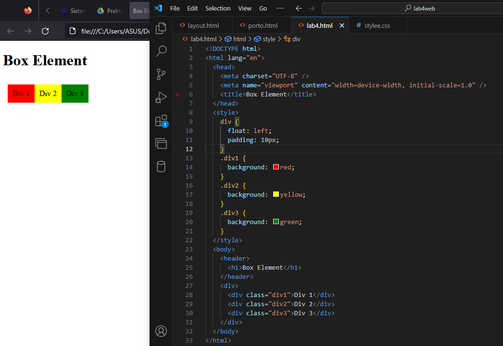
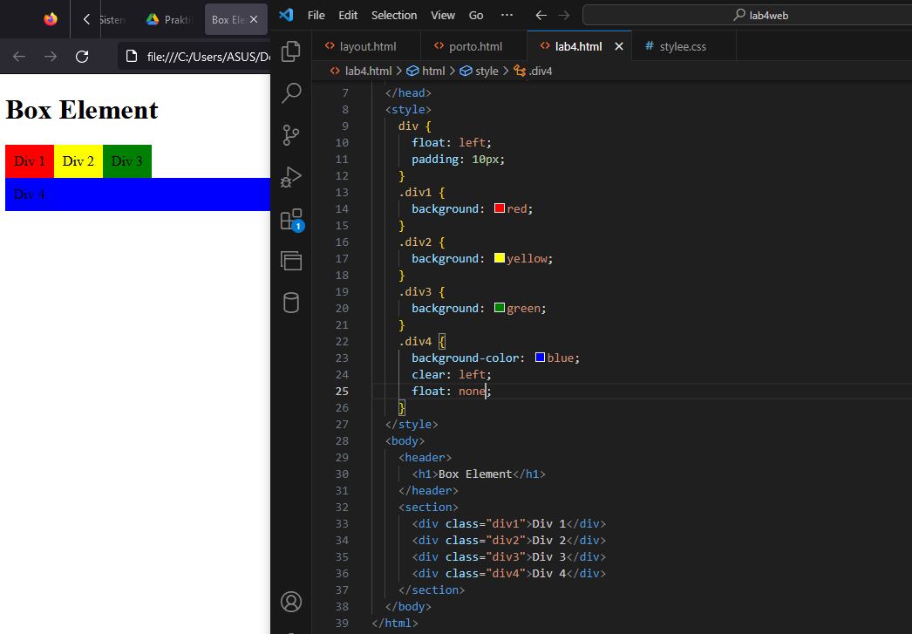
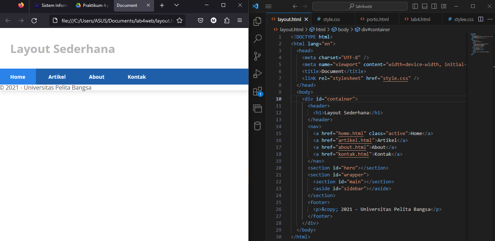

# Praktikum

## Membuat box element



lalu menambahkan element baru pada gambar dibawah ini:



## Membuat layout sederhana
### membuat navigasi 
```
<!DOCTYPE html>
<html lang="en">
  <head>
    <meta charset="UTF-8" />
    <meta name="viewport" content="width=device-width, initial-scale=1.0" />
    <title>Document</title>
    <link rel="stylesheet" href="style.css" />
  </head>
  <body>
    <div id="container">
      <header>
        <h1>Layout Sederhana</h1>
      </header>
      <nav>
        <a href="home.html" class="active">Home</a>
        <a href="artikel.html">Artikel</a>
        <a href="about.html">About</a>
        <a href="kontak.html">Kontak</a>
      </nav>
      <section id="hero"></section>
      <section id="wrapper">
          <section id="main"></section>
          <aside id="sidebar"></aside>
      </section>
      <footer>
          <p>&copy; 2021 - Universitas Pelita Bangsa</p>
      </footer>
```
kemudian tambahkan kode css ke dalam html
```
@import url("https://fonts.googleapis.com/css2?family=Open+Sans:ital,wght@0,300;0,400;0,600;0,700;0,800;1,300;1,400;1,600;1,700;1,800&display=swap");
@import url("https://fonts.googleapis.com/css2?family=Open+Sans+Condensed:ital,wght@0,300;0,700;1,300&display=swap");

* {
  margin: 0;
  padding: 0;
}
body {
  line-height: 1;
  font-size: 100%;
  font-family: "Open Sans", sans-serif;
  color: #5a5a5a;
}
#container {
  width: 980px;
  margin: 0 auto;
  box-shadow: 0 0 1em #cccccc;
}
header {
  padding: 20px;
}
header h1 {
  margin: 20px 10px;
  color: #b5b5b5;
}
nav {
  display: block;
  background-color: #1f5faa;
}
nav a {
  padding: 15px 30px;
  display: inline-block;
  color: #ffffff;
  font-size: 14px;
  text-decoration: none;
  font-weight: bold;
}
nav a.active,
nav a:hover {
  background-color: #2b83ea;
}
```



